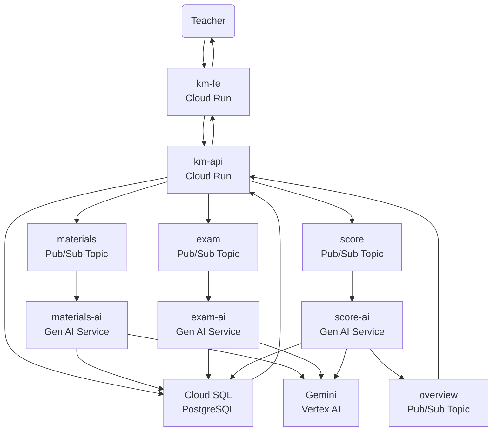

# 🧠 KM.ai — Ketua Murid AI

> Your Digital Teaching Assistant — powered by Google Cloud Run & Gemini

---

## 🚀 Overview

**KM.ai (Ketua Murid AI)** is an intelligent assistant designed to help teachers automate lesson preparation, exam creation, and grading — reducing repetitive tasks while maintaining teaching quality.

The project runs entirely on **Google Cloud Run**, using **Gemini (Vertex AI)** and **Pub/Sub** for scalable, event-driven AI workloads.

---

## 💡 Core Concept

Inspired by the real-world _Ketua Murid_ (class leader) in Indonesian classrooms, **KM.ai** acts as a digital assistant for teachers — handling administrative and repetitive academic tasks so teachers can focus on teaching.

---

## ✨ Key Features

### 🏫 Teacher Workflow

- **📘 Upload Materials** → AI organizes and structures content into lessons.
- **🧩 Create Exams** → Generates both multiple-choice and essay questions.
- **📤 Upload Answers** → AI evaluates and provides detailed feedback.
- **📊 Student Progress Dashboard** → Summarized analytics for teachers.

### ⚙️ Technical Highlights

- **Serverless architecture** via Cloud Run
- **Event-driven workflow** powered by Pub/Sub
- **Gemini (Vertex AI)** for content generation and scoring
- **Cloud SQL (PostgreSQL)** for persistent data storage
- **Vite + React + Shadcn UI** for a modern, modular frontend

---

## 🧱 Architecture

### 🧩 Service Breakdown

| Service                | Description                                   | Stack                          |
| ---------------------- | --------------------------------------------- | ------------------------------ |
| **km-fe**              | Frontend web app for teachers                 | Vite + React + Shadcn UI       |
| **km-api**             | Core API gateway handling CRUD + Pub/Sub      | Node.js + Express              |
| **materials-ai**       | AI worker for generating structured materials | Node.js + Google Generative AI |
| **exam-ai**            | AI worker for exam creation                   | Node.js + Gemini API           |
| **score-ai**           | AI worker for scoring & feedback              | Node.js + Gemini + Pub/Sub     |
| **Cloud SQL**          | Stores class, student, and exam data          | PostgreSQL                     |
| **Gemini (Vertex AI)** | Foundation model for generation and reasoning | Vertex AI                      |

---

## 🧩 Data Flow Summary

1. Teacher uploads materials or creates exams.
2. `km-api` publishes events (materials, exam, score) to Pub/Sub topics.
3. Dedicated Cloud Run AI services consume events and process them using Gemini.
4. Results are stored in Cloud SQL and optionally re-published for aggregation.
5. `km-fe` fetches updates from `km-api` and displays results to the teacher dashboard.

---

## 🧠 Built With

- **Google Cloud Run** – Serverless container hosting
- **Cloud SQL (PostgreSQL)** – Relational database
- **Vertex AI (Gemini)** – Generative AI model integration
- **Pub/Sub** – Asynchronous event communication
- **Vite + React + Shadcn UI** – Frontend framework
